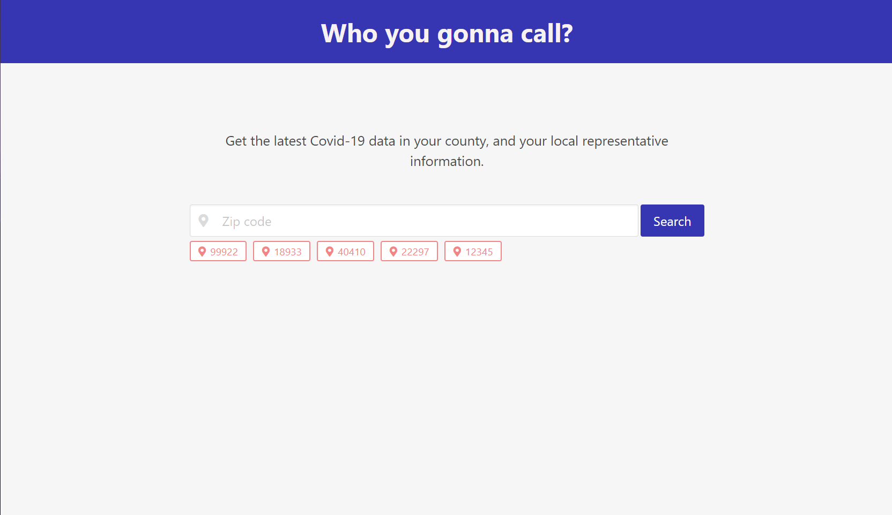
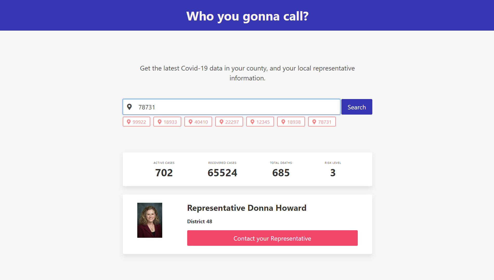

# Who You Gonna Call?
## Description
This application provides users with up-to-date data on their local Covid-19 cases when given a zip code:
* Active Cases
* Recovered Cases
* Total Deaths
* Risk Level
<!--END OF LIST-->
Furthermore the app provides a link to their political representative's contact information.
This way users can consider how their county is fairing, and streamline communication to the offices in charge of managing this pandemic.
## Built With
* HTML
* JavaScript
    * JQuery
* CSS
    * Bulma
## Website
https://jpkashlak.github.io/who-you-gonna-call/
## Preview

